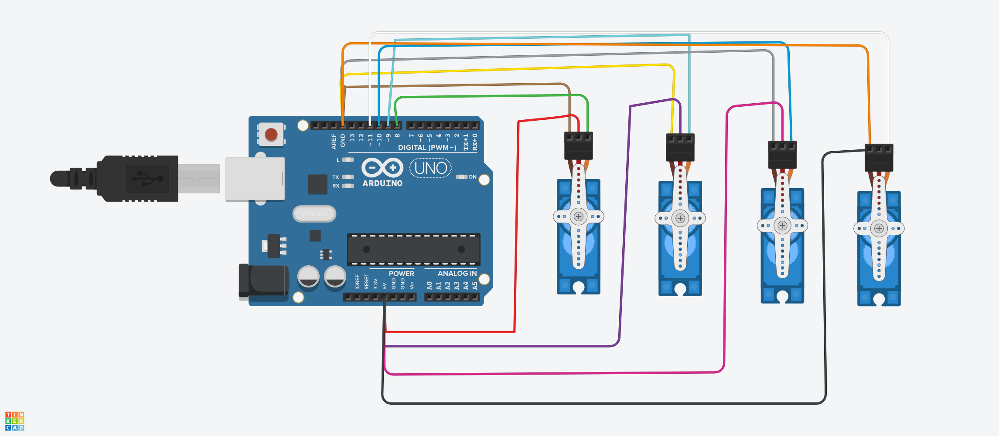

# 🤖 Servo Motors Sweep Task

## 📌 Project Overview

This project demonstrates controlling **four servo motors** using an **Arduino Uno** in **Tinkercad**.

The program performs the following actions:

- Run all four servo motors using the **Sweep** motion.
- Continue sweeping for **2 seconds**.
- Move all servo motors to **90°**.
- Keep all motors fixed at **90°**.

---

# 🎯 Project Requirements

- Arduino Uno
- 4 Servo Motors
- Jumper Wires
- Tinkercad

---

# 🔌 Circuit Diagram


---

# ⚙️ Connections

| Servo Motor | Arduino Pin |
|-------------|-------------|
| Servo 1 | D8 |
| Servo 2 | D9 |
| Servo 3 | D10 |
| Servo 4 | D11 |

Power Connections:

- Red → 5V
- Brown → GND
- Orange (Signal) → Digital Pin

---

# 🚀 Program Flow

```text
Start
   │
   ▼
Move all servos
0° → 180°
   │
   ▼
Move back
180° → 0°
   │
   ▼
Repeat for 2 seconds
   │
   ▼
Move all servos to 90°
   │
   ▼
Stop Program
```

---

# 💻 Arduino Code

The Arduino source code is available in:

```
Servo_Task.ino
```

---

# 🎥 Demonstration Video

The project demonstration video is included in the repository.

```
demo.mp4
```

---

# 📂 Project Structure

```
servo-motors-sweep-task
│
├── README.md
├── Servo_Task.ino
├── demo.mp4
└── Funky Esboo.png

```

---

# 🛠️ Software Used

- Arduino IDE
- Tinkercad
- GitHub

---

# 📷 Project Screenshot


---

# 👨‍💻 Author

**Hashim Almaramhi**

Artificial Intelligence Student
